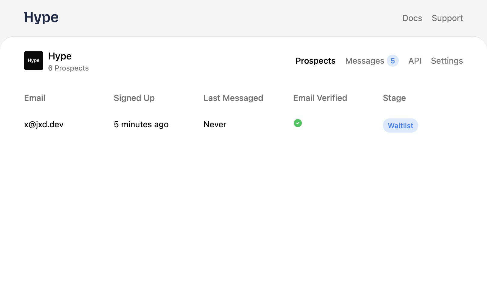

By default all prospects are sent an email to verify their email address. This can be configured further from `Project` -> `Settings` -> `Email Verification`.

Project owners can filter prospects by email verification status in the `Prospects` page.