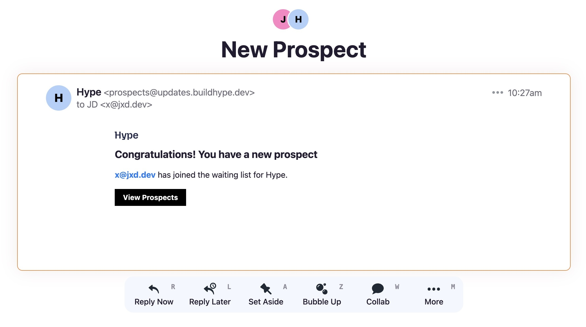

Notifications can be configured for your waitlist from `Project` -> `Settings` -> `Notifications`.

## New Prospect

You can choose to send an email for each new prospect that joins the waiting list or batch them up into a single daily, weekly or monthly email.